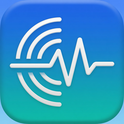
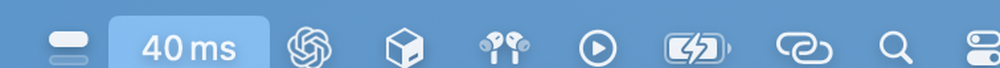
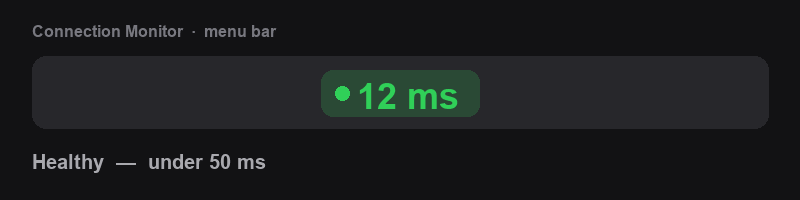
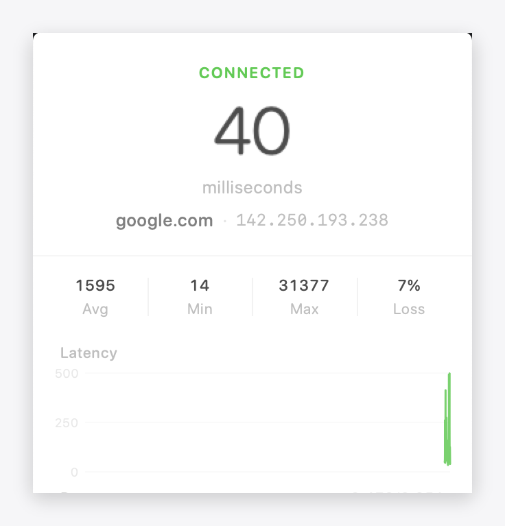
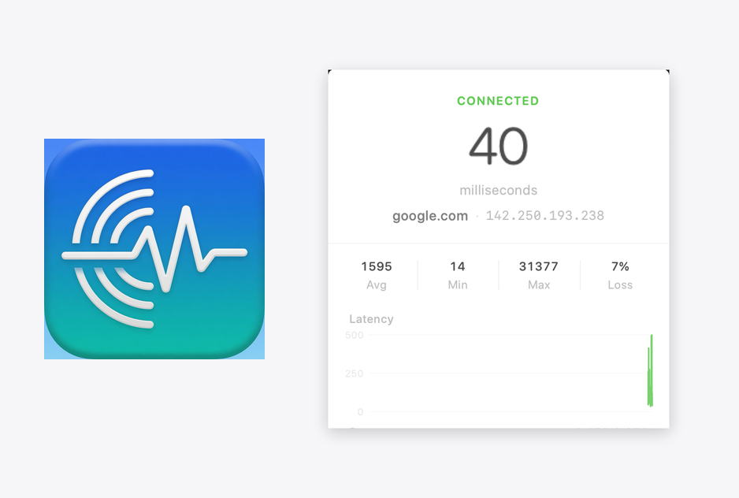

# Connection Monitor

<p align="center">
  
</p>

Native **macOS menu bar** app for continuous live connection monitoring — like `ping google.com` in Terminal, always in your menu bar.


[](https://github.com/olishiz/connection-monitor/pkgs/npm/connection-monitor)

Minimal Apple-style UI · color-coded RTT · stats · latency chart · recent replies.

**Package:** [`@olishiz/connection-monitor`](https://github.com/olishiz/connection-monitor/pkgs/npm/connection-monitor) on [Packages](https://github.com/olishiz?tab=packages)  
*(Native Mac app — install with Homebrew or the DMG, not `npm install`.)*

---

## Preview

### Menu bar

Live latency sits next to your system icons — color tells you the state at a glance:



### Color states



| Color | Latency | Meaning |
|-------|---------|---------|
| 🟢 Green | &lt; 50 ms | Healthy |
| 🟠 Orange | 50–149 ms | Degraded / slow |
| 🔴 Red | ≥ 150 ms or offline | Bad / down |

### Popover

Click the menu bar item for the full panel:

<p align="center">
  
</p>

### App icon + UI

<p align="center">
  
</p>

---

## Install

### Homebrew (recommended)

```bash
brew tap olishiz/tap
brew trust olishiz/tap          # required by modern Homebrew for third-party taps
brew install --cask connection-monitor
```

### Download

Grab the latest **`.dmg`** from [Releases](https://github.com/olishiz/connection-monitor/releases):

1. Open `ConnectionMonitor-x.y.z.dmg`
2. Drag **Connection Monitor** → **Applications**
3. Open the app (first launch may need **right-click → Open** if unsigned)
4. Check the menu bar for the status dot + latency

### Build from source

```bash
git clone https://github.com/olishiz/connection-monitor.git
cd connection-monitor
open ConnectionMonitor.xcodeproj
# Press ⌘R
```

CLI:

```bash
xcodebuild -scheme ConnectionMonitor -configuration Release \
  -derivedDataPath build \
  CODE_SIGN_IDENTITY="-" CODE_SIGNING_REQUIRED=NO

open build/Build/Products/Release/ConnectionMonitor.app
```

## Features

| | |
|--|--|
| **Menu bar** | Color-coded latency (green / orange / red) + status dot |
| **Popover** | Large latency, avg/min/max/loss, thin chart, recent list |
| **Engine** | Continuous `/sbin/ping` (real ICMP) |
| **Host** | Change anytime (`google.com`, `1.1.1.1`, …) |

## How it works

```
/sbin/ping -i 1  ──►  PingEngine  ──►  menu bar + popover UI
```

`LSUIElement` agent: no Dock icon. Quit from the popover or **⌘Q**.

## Project layout

```
connection-monitor/
├── ConnectionMonitor.xcodeproj
├── ConnectionMonitor/          # SwiftUI sources
├── Branding/                   # App icon master
├── docs/                       # README screenshots & demo GIF
├── LICENSE
└── README.md
```

## Notes

- Sandbox is off so the app can run system `ping` (personal utility).
- For distribution beyond your Mac, sign & notarize with an Apple Developer ID.
- Real install path: **Homebrew** or **Releases (DMG)**. The GitHub Package is a profile listing only.

## License

[MIT](LICENSE) © 2026 Oliver Sim
